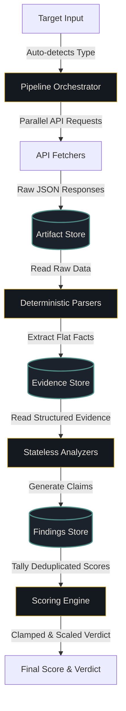
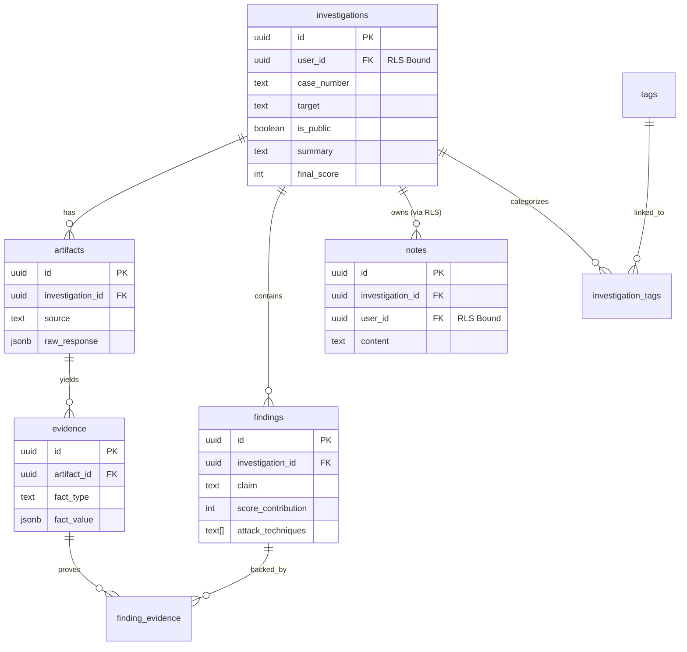

<h1 align="center">
  NoCap Platform
</h1>
<p align="center">A Traceable, Explainable Threat Intelligence & Triage Workspace</p>

<p align="center">
  
  
  
  
</p>

<p align="center">
  Ingests raw targets, orchestrates parallel API fetchers, parses atomic evidence, and runs stateless analyzers to generate scored threat findings.
</p>

---

## Live Demo & Credentials

**Public Live Instance:** [https://nocap-2ml7e6h98-alivexds-projects.vercel.app](https://nocap-2ml7e6h98-alivexds-projects.vercel.app)

To test the application as an analyst, you can use the following demo credentials:
* **Email:** `demo@nocap.com`
* **Password:** `demo1234`

---

## Overview

**NoCap** is a threat intelligence triage workspace that separates raw API fetching, parsing, analysis, and scoring into distinct stages so every score is traceable back to raw evidence. 

Unlike traditional "black-box" reputation scanners that output arbitrary malicious scores without context, NoCap is built on a strict **immutable evidence chain**. Every score, indicator, or severity warning is traceable back to the raw JSON response and HTTP bytes that produced it. Analysts can inspect any finding, click on its score contribution, and view the raw payload behind the alert.

---

## Use Cases

* **Incident Triage Desk:** Submit an IP, domain, file hash, or URL and receive a structured, aggregated threat report in under 1.5 seconds.
* **Suspicious Email Triage:** Ingest raw EML headers to verify SPF/DKIM/DMARC alignment, trace relay hops, and detect brand homograph impersonations.
* **Attack Surface Profiling:** Input a root host to enumerate subdomains via Certificate Transparency logs (crt.sh), fingerprint server stack responses, and scan public GitHub code leakages.
* **CVE Prioritization (CVE Watch):** Monitor product names and vulnerability IDs, cross-referencing them against CISA KEV (Known Exploited Vulnerabilities) and Exploit-DB vectors.
* **Public Case Sharing:** Instantly share a read-only threat investigation via public demo URLs to coordinate with external teams or stakeholders.

---

## Project Architecture Traits

| Component | Reality-Backed Implementation |
| :--- | :--- |
| **Frontend Layouts** | Next.js 15 App Router with private Investigator Dashboards & Public Case-Sharing Views |
| **Ingestion Pipeline** | Decoupled execution flow: Ingest (Fetchers) ➔ Parse (Extractors) ➔ Analyze (Stateless Analyzers) |
| **Database Security** | Strict PostgreSQL Row-Level Security (RLS) enforcing Tenant Isolation across all tables |
| **Intelligence Feeds** | Real integrations with VirusTotal, AbuseIPDB, ip-api.com, WHOIS, crt.sh, and NVD |
| **API Boundary** | Strict 401 JSON authorization (no 307 redirects) + JWT Bearer token support |
| **Environment Integrity** | `VERCEL_ENV` Fail-Closed gates preventing test-bypasses from reaching production |

---

## Features & Architecture Upgrades

We have heavily invested in enterprise-grade security boundaries, architectural decoupling, and headless deployment capabilities.

### Security & API Hardening
- **Headless JWT Bearer Auth:** The Supabase SSR client is extended to fully support headless `Authorization: Bearer <token>` API requests. This bypasses Next.js cookie restrictions, making NoCap perfectly suited for CI/CD integrations, CLI tooling, and machine-to-machine automations.
- **Strict API Boundaries (401 vs 307):** Next.js middleware is hardened to return strict `401 Unauthorized` JSON responses for unauthorized API calls, completely eliminating dangerous `307 Redirect` to `/login` behaviors that cause frontend router bugs and accidental data leakage.
- **VERCEL_ENV Fail-Closed Security:** The middleware evaluates environment configurations dynamically. If the environment is misconfigured or `VERCEL_ENV` fails integrity checks, the app fails closed with a `500 Internal Server Error`, ensuring zero test bypasses go live to production.
- **Row-Level Security (RLS) & Tenant Isolation:** API boundaries strictly enforce tenant isolation. If a user attempts to view, modify, or interact with an investigation or note they do not own, the API responds with a `404 Not Found` (to hide resource existence entirely) or `403 Forbidden`.
- **Global API Rate Limiting:** All routes are protected by Redis/database-backed rate limiters (e.g., 5 case creations per minute) to protect external intelligence API quotas from abuse.
- **Decoupled Cron Authentication:** A middleware whitelist opens `/api/cron/*`, delegating strict authorization directly to the route handlers via a cryptographic `CRON_SECRET` check. This isolates background job triggers from user sessions.

### UI & Visualization
- **Spider/Radar Threat Charts:** A highly customized, pure-SVG brutalist Radar Chart breaks down threat intelligence scores across three domains: `Infrastructure`, `Malware / Reputation`, and `Phishing / Email`. Unanalyzed dimensions gracefully fall back to a dashed "Not Analyzed" aesthetic, preventing misleading zero-scores.
- **Dark-Mode Institutional Aesthetic:** NoCap uses vanilla CSS with a curated palette of greys, muted accents, and monospace fonts to create a highly focused, no-nonsense security dashboard.

---

## Validated Test Cases

The following complex end-to-end security test suites verify NoCap's security boundaries:

1. **End-to-End Tenant Isolation (Multi-User Ownership Test):** 
   - **Scenario:** User A creates an investigation and adds a private note. User B attempts to `PATCH` or `GET` User A's note using raw API requests.
   - **Verifies:** The backend returns a rigid `404 Not Found` at the database lookup level due to the strict `eq('user_id', session.user.id)` constraint, hiding the existence of the resource entirely from the unauthorized tenant.
2. **Headless Authentication Test:**
   - **Scenario:** CLI script signs in natively via the Supabase Auth REST API (`grant_type=password`), parses the resulting JWT `access_token`, and issues `curl` requests with an `Authorization: Bearer` header against protected `/api/investigations` endpoints.
   - **Verifies:** The backend middleware correctly intercepts the Bearer token, bypasses Next.js cookie stores, and validates the session natively.
3. **Cron Job Authorization Test:**
   - **Scenario:** A simulated background worker sends a `POST` request to `/api/cron/cve-watch` using a valid vs invalid `Authorization: Bearer <CRON_SECRET>`.
   - **Verifies:** Valid secrets execute the job; invalid secrets return immediate `401 Unauthorized`.
4. **Batch Rate Limit Stress Test:**
   - **Scenario:** A script fires 20 rapid, concurrent requests to protected endpoints.
   - **Verifies:** The API properly accepts the first 5 requests and gracefully returns `429 Too Many Requests` with rate-limit headers for the overflow, shielding upstream providers.

---

## System Architecture

NoCap enforces a strict, decoupled request lifecycle:



---

## SOC Investigation Lifecycle

Below is the exact workflow trace when a target (e.g. `185.190.140.9`) is analyzed:

```
Target Input (185.190.140.9)
     │
     ▼
[Artifact Created] ────► Fetches raw JSON from VirusTotal, AbuseIPDB, ip-api concurrently
     │
     ▼
[Evidence Extracted] ──► Parsers slice atomic facts: malicious_count (14), asn_number (9009)
     │
     ▼
[Findings Generated] ──► Stateless Analyzers run. ASNReputation rules trigger on M247 Ltd (abusive ASN)
     │
     ▼
[Score Compiled] ─────► Radar Chart categories map generated findings; Threat Score clamps deduplicated claims (e.g. 42 - Suspicious)
```

---

## Database Schema

The database relies on strict row-level security (RLS) to enforce tenant isolation across a cascading 9-table schema:



---

## API Specifications (Strict Boundaries)

### Submit Target for Investigation (POST `/api/investigations`)
- **Headers:** `Cookie: session` OR `Authorization: Bearer <token>`
- **Payload:** `{ "target": "malicious-domain.com", "investigationType": "ioc" }`
- **Response (201 Created):** `{ "id": "b6a7b8c9-d0e1..." }`
- **Security:** Returns `401 Unauthorized` (JSON) if unauthenticated. Fails if rate-limited.

### Fetch Case JSON Detail (GET `/api/investigations/[id]`)
- **Headers:** `Cookie: session` OR `Authorization: Bearer <token>`
- **Response (200 OK):** Fully hydrated JSON document mapping artifacts, evidence, and findings.
- **Security:** Returns `404 Not Found` if `user_id` does not own the investigation (hiding the ID's existence).

### Trigger CVE Watch (POST `/api/cron/cve-watch`)
- **Headers:** `Authorization: Bearer <CRON_SECRET>`
- **Security:** Bypasses standard Next.js user session middleware but strictly enforces the cryptographic cron secret at the route level.

---

## Technology Stack

| Domain | Technology | Description |
| :--- | :--- | :--- |
| **Frontend Framework** | Next.js 15 (App Router) | High-performance React framework. |
| **Database Tier** | PostgreSQL (hosted via Supabase) | Primary relational store. |
| **Authentication** | Supabase SSR Session Cookies / JWT Bearer | Secure stateful and headless token verification. |
| **Styling & Theme** | Vanilla CSS + IBM Plex Sans/Mono | Institutional, minimal dashboard layout. |
| **Intelligence Feeds** | NIST NVD, crt.sh, CISA KEV | Free public threat intelligence feeds. |

---

## Deployment Guide (Vercel)

Making NoCap public and deploying it is incredibly straightforward using Vercel and Supabase.

### 1. Database Setup (Supabase)
1. Create a new project on [Supabase](https://supabase.com/).
2. Navigate to the SQL Editor and run the migrations found in `supabase/migrations/`:
   - `001_initial_schema.sql` (Creates base schema & RLS rules)
   - `002_add_cve_type.sql` (Alters types to add CVE)
3. Run `supabase/seed.sql` to populate base configurations & scoring profiles.

### 2. Vercel Deployment
1. Push your NoCap repository to GitHub.
2. Import the project into your [Vercel](https://vercel.com/) dashboard.
3. Vercel will automatically detect the Next.js framework.
4. Add the following **Environment Variables** in Vercel:
   ```env
   # Supabase Configuration
   NEXT_PUBLIC_SUPABASE_URL=https://your-project-id.supabase.co
   NEXT_PUBLIC_SUPABASE_ANON_KEY=your-anon-key
   SUPABASE_SERVICE_ROLE_KEY=your-service-role-key
   
   # Intelligence API Keys (Required for analyzers to function)
   VIRUSTOTAL_API_KEY=your-virustotal-key
   ABUSEIPDB_API_KEY=your-abuseipdb-key
   GITHUB_API_TOKEN=your-github-token
   
   # Security
   CRON_SECRET=generate-a-strong-secret-here
   ```
5. Click **Deploy**. Vercel will build the application and set `VERCEL_ENV="production"`. The middleware's fail-closed security automatically adapts to this environment variable to enforce production-grade security rules.

### 3. Local Development Startup
```bash
git clone https://github.com/alive-xd/NoCap.git
cd NoCap/nocap-app
npm install

# Add your .env.local file with the variables listed above
npm run dev
```

---

## Contributing
Please review our Contributing Guide for pipeline design regulations, testing specifications, and pull request guidelines.

---

## License
NoCap is open-source software licensed under the **MIT License** - see the `LICENSE` file for details.
