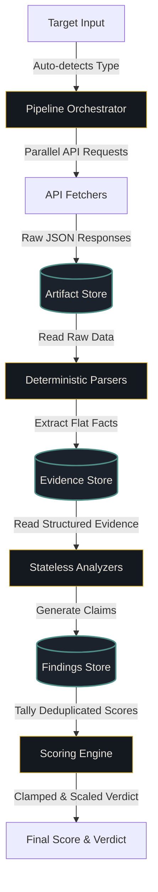
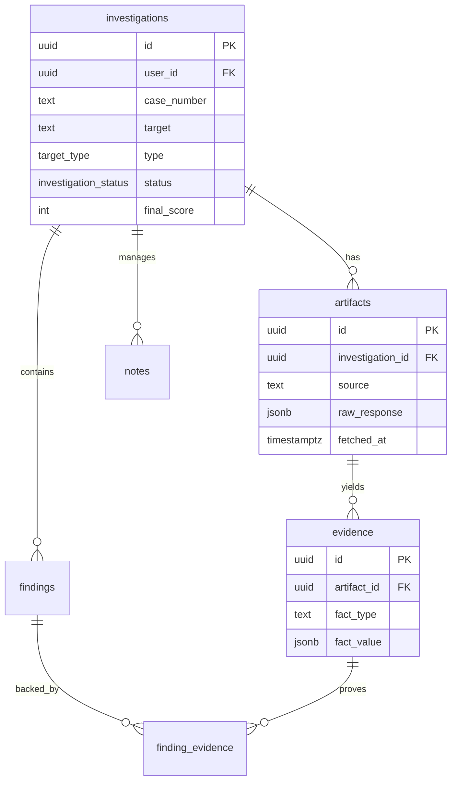

<h1 align="center">
   NoCap Platform
</h1>
<p align="center">A Traceable, Explainable Threat Intelligence & Triage Workspace</p>

<p align="center">
  
  
  
</p>

<p align="center">
  Designed using enterprise architecture patterns for modern security response teams.
</p>

---

## 🌟 Overview

**NoCap** is an enterprise-grade, evidence-backed threat intelligence triage workspace. 

Unlike traditional "black-box" reputation scanners that output arbitrary malicious scores without context, NoCap is built on a strict **immutable evidence chain**. Every score, indicator, or severity warning is traceable back to the raw JSON response and HTTP bytes that produced it. Analysts can inspect any finding, click on its score contribution, and view the raw payload behind the alert.

---

## 🏢 Use Cases

* **Incident Triage Desk:** Submit an IP, domain, file hash, or URL and receive a structured, aggregated threat report in under 1.5 seconds.
* **Suspicious Email Triage:** Ingest raw EML headers to verify SPF/DKIM/DMARC alignment, trace relay hops, and detect brand homograph impersonations.
* **Attack Surface Profiling:** Input a root host to enumerate subdomains via Certificate Transparency logs (crt.sh), fingerprint server stack responses, and scan public GitHub code leakages.
* **CVE Prioritization (CVE Watch):** Monitor product names and vulnerability IDs, cross-referencing them against CISA KEV (Known Exploited Vulnerabilities) and Exploit-DB vectors.

---

## 📊 Project Statistics

| Component | Metric / Scope |
| :--- | :--- |
| **Frontend Layouts** | 8 Custom Case-File Viewports |
| **Ingestion Pipeline** | Decoupled Ingest ➔ Parse ➔ Analyze |
| **Database Tables** | 7 Tables with cascading deletes |
| **Intelligence Feeds** | VirusTotal, AbuseIPDB, ip-api.com, WHOIS, crt.sh, NVD |
| **API Endpoints** | 10 REST Handlers + CVE Cron Scheduler |
| **Local Cache Speed** | < 50ms read response on cache hits |

---

## ✨ Current Capabilities

### ✅ Fully Implemented
- **Concurrent Ingestion:** Fetches intelligence API sources concurrently using `Promise.allSettled` to lower indicator lookup latency.
- **Source-Specific Cache TTL:** Caches raw API responses dynamically based on volatility (WHOIS 72h, IP ASN 48h, VirusTotal 6h, AbuseIPDB 6h).
- **Whitespace Target Validation:** Rejects empty or whitespace-only inputs with a validation warning.
- **Concurrency Safety:** Automatically retries sequence number updates using randomized backoffs (jitter of 50-250ms) to avoid database insert conflicts.
- **CSRF Middlewares Security:** Enforces origin and referer verification on all mutating endpoints.
- **Parametrized PostgREST Filters:** Sanitizes input strings in global search query builders to prevent syntax injection crashes.
- **Database-Backed Rate Limiting:** Enforces a rate limit of 5 case creation requests per minute per user to protect intelligence API key quotas.
- **Fail-Closed Cron Authorization:** Hardens the scheduled CVE watch trigger endpoint to reject requests if `CRON_SECRET` is unset or invalid in the environment.
- **Route-Level Ownership Guards:** Implements redundant app-layer user-ownership checks on note updates (`PATCH`) and tag link removals (`DELETE`).

### ⚠️ Planned Roadmap
- **Automated Narrative Summaries (Architecture Ready):** OpenRouter model orchestration to translate complex finding trees into structured executive summaries.
- **MITRE ATT&CK Technique Tagging:** Automatically tag indicators against ATT&CK frameworks.
- **Executive PDF Export:** Generate printable forensic PDF briefings for incident response handoffs.

---

## 🏗️ System Architecture

NoCap enforces a strict, decoupled request lifecycle:



---

## 🔄 SOC Investigation Lifecycle

Below is the workflow trace of a target inquiry (e.g. `185.190.140.9`):

```
Target Input (185.190.140.9)
     │
     ▼
[Artifact Created] ────► Stores raw VirusTotal and ip-api JSON payloads
     │
     ▼
[Evidence Extracted] ──► Slices facts: malicious_count (14), asn_number (9009)
     │
     ▼
[Findings Generated] ──► ASNReputation rules trigger on M247 Ltd (abusive ASN)
     │
     ▼
[Score Compiled] ─────► Deduplicates claims, tallies final score (42 - Suspicious)
```

---

## 🛠️ Technology Stack

| Domain | Technology | Description |
| :--- | :--- | :--- |
| **Frontend Framework** | Next.js 15 (App Router) | High-performance React framework. |
| **Database Tier** | PostgreSQL (hosted via Supabase) | Primary relational store. |
| **Authentication** | Supabase SSR Session Cookies | Secure stateful cookie verification. |
| **Styling & Theme** | Vanilla CSS + IBM Plex Sans/Mono | Institutional, minimal dashboard layout. |
| **Intelligence Feeds** | NIST NVD, crt.sh, CISA KEV | Free public threat intelligence feeds. |

---

## 🗄️ Database Schema

The database consists of cascading tables with enforced row-level security (RLS) policies:



---

## 🔌 API Specifications

### Create Investigation
- **Endpoint:** `POST /api/investigations`
- **Payload:**
  ```json
  {
    "target": "malicious-domain.com",
    "investigationType": "ioc"
  }
  ```
- **Response (201 Created):**
  ```json
  { "id": "b6a7b8c9-d0e1-f2a3-b4c5-d6e7f8a9b0c1" }
  ```

### Fetch Case JSON Detail
- **Endpoint:** `GET /api/investigations/[id]`
- **Response (200 OK):**
  ```json
  {
    "id": "b6a7b8c9-d0e1-f2a3-b4c5-d6e7f8a9b0c1",
    "case_number": "NC-2026-00042",
    "target": "malicious-domain.com",
    "final_score": 85
  }
  ```

---

## 🚀 Setup & Startup

### 1. Clone & Install
```bash
git clone https://github.com/alive-xd/NoCap.git
cd NoCap/nocap-app
npm install
```

### 2. Configure Environment
Create `.env.local` in `nocap-app/`:
```env
NEXT_PUBLIC_SUPABASE_URL=https://your-project-id.supabase.co
NEXT_PUBLIC_SUPABASE_ANON_KEY=your-anon-key
SUPABASE_SERVICE_ROLE_KEY=your-service-role-key

VIRUSTOTAL_API_KEY=your-virustotal-key
ABUSEIPDB_API_KEY=your-abuseipdb-key
GITHUB_API_TOKEN=your-github-token
```

### 3. Apply Schema migrations
Execute in your Supabase SQL editor:
1. Run `supabase/migrations/001_initial_schema.sql` (Creates base schema & RLS rules)
2. Run `supabase/migrations/002_add_cve_type.sql` (Alters types to add CVE)
3. Run `supabase/seed.sql` (Populates base configurations & scoring profiles)

### 4. Boot Dev Server
```bash
npm run dev
```

---

## ❓ FAQ

**Q: Can I run NoCap offline?**
A: Analyzed cases and cached artifacts are visible offline. However, new triage scans require active connections to the external intelligence providers.

**Q: How do I request a custom score weight?**
A: All baseline score distributions are seeded in the database's `scoring_profiles` metadata table. You can customize weights directly via migrations or SQL queries.

---

## 🤝 Contributing
Please review our Contributing Guide for pipeline design regulations, testing specifications, and pull request guidelines.

---

## 📜 License
NoCap is open-source software licensed under the **MIT License** - see the `LICENSE` file for details.
