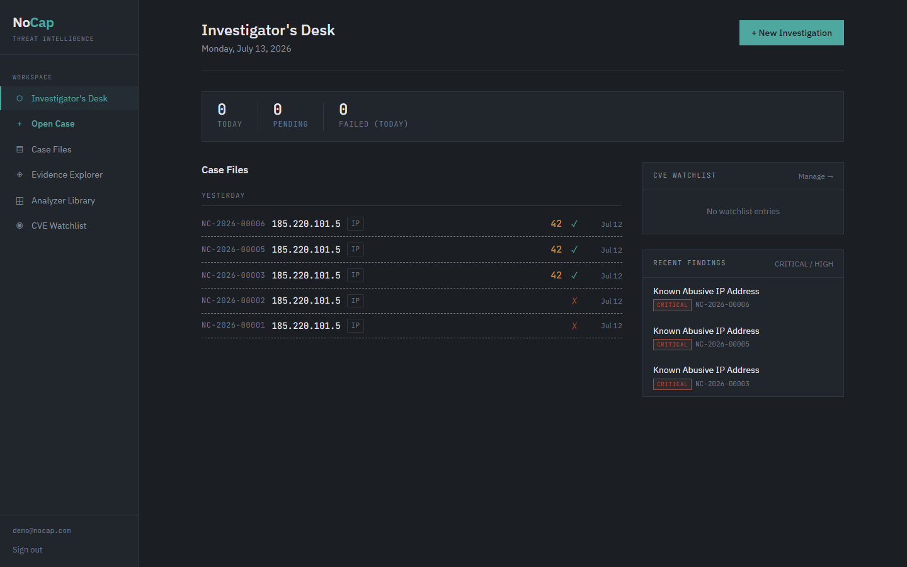
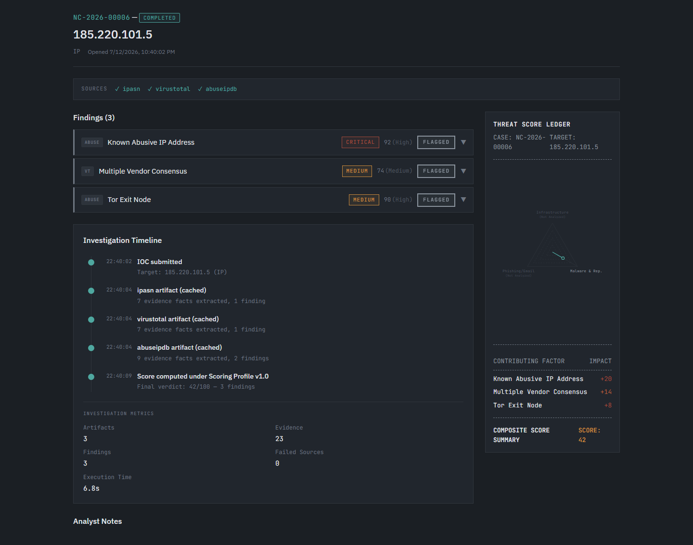
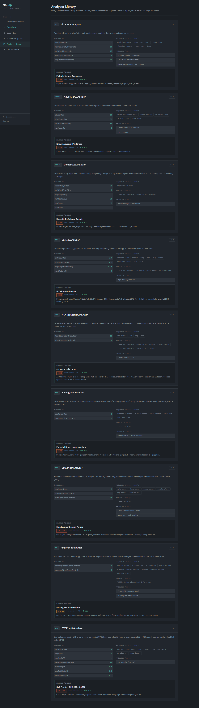
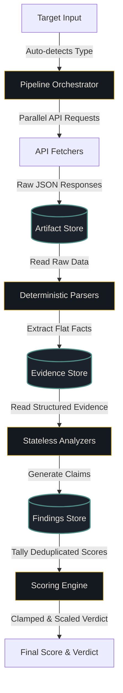

# NoCap Platform

NoCap is an explainable threat intelligence triage workspace designed for security analysts and incident responders who require fully transparent, evidence-backed risk analysis. Rather than outputting a single, unexplained reputation score, NoCap implements a decoupled ingestion and analysis pipeline where every finding and score adjustment is strictly traceable to raw evidence. Analysts can drill down from any aggregated risk indicator directly into the underlying parsed facts and raw API response payloads, ensuring complete auditability during security incident triages.

## Live Demo
* **Live Workspace**: [https://nocap-app-beryl.vercel.app/](https://nocap-app-beryl.vercel.app/)
* **Public Case Demo**: [https://nocap-app-beryl.vercel.app/demo/58b39b21-b060-4288-b877-f5827549797d](https://nocap-app-beryl.vercel.app/demo/58b39b21-b060-4288-b877-f5827549797d) (Zero-authentication sharing; no login credentials required to view this case).

---

## Workspace Preview


*The Investigator's Desk dashboard displays active, completed, and failed threat cases with global statistics.*


*The case details page maps infrastructure, reputation, and email risk vectors using an SVG radar chart alongside verified findings.*


*The Analyzer Library maps stateless modules to their evaluated inputs, descriptions, and threat categorization.*

---

## Pipeline Architecture

NoCap enforces a strict, unidirectional request and data lifecycle:



For a detailed analysis of the pipeline stages, data caching policies, and schema structures, view the [ARCHITECTURE.md](file:///x:/NoCap/nocap-app/ARCHITECTURE.md) document.

---

## Technical Stack
* **Frontend**: Next.js 16.2.10 (App Router, Server Components) with Vanilla CSS styling.
* **Database & Auth**: Supabase / PostgreSQL 16 with Row-Level Security (RLS) policies and stateful session + headless JWT verification.
* **Testing**: Vitest unit testing and Playwright E2E browser automation.
* **Hosting**: Vercel.

---

## Core Engineering Decisions

* **External API Integration & Graceful Degradation**: Outbound connections to external intelligence feeds (VirusTotal, AbuseIPDB, WHOIS, IP-ASN, crt.sh, NVD) enforce strict 8-second timeouts. If a single source times out or fails, the pipeline completes with degraded confidence, applying scoring adjustments rather than failing the entire run.
* **Active MITRE ATT&CK Mapping**: Threat findings generated by analyzers are dynamically mapped to real MITRE ATT&CK techniques (e.g., T1566 for Phishing, T1586 for Compromised Accounts) to provide structured context in reports and briefings.
* **Defense-in-Depth Tenant Isolation**: Access control is enforced via Supabase PostgreSQL RLS policies combined with explicit application-level ownership checks on case retrieval routes. Unauthorized read requests fail closed and return `404 Not Found` to conceal resource existence.
* **API Protection & Rate Limiting**: Mutating API endpoints enforce rate-limiting rules (maximum 5 case creations per user per minute) to preserve external API quotas.
* **Comprehensive Test Coverage**: Supported by 184 passing unit and integration tests (covering parsers, analyzers, orchestrator, and scoring calculations) alongside automated E2E tests verifying headers, script escaping, rate-limiting, and tenant isolation.
* **Automated CI/CD**: Standardized build checks, typechecks, and tests are run automatically via GitHub Actions workflows on every commit push.

---

## Local Setup

Ensure Node.js 18+ is installed on your system.

### 1. Database Setup
1. Create a Supabase project instance.
2. In the SQL Editor, execute the migration files sequentially from [supabase/migrations/](file:///x:/NoCap/nocap-app/supabase/migrations/):
   * `001_initial_schema.sql` (Creates schemas, tables, and RLS rules).
   * Run files `002_add_cve_type.sql` through `008_restore_pipeline_statuses.sql` in numerical order.
3. Run the [seed.sql](file:///x:/NoCap/nocap-app/supabase/seed.sql) script to load the default scoring profiles.

### 2. Environment Configuration
Create a `.env.local` file in the root of the `nocap-app` directory:
```env
NEXT_PUBLIC_SUPABASE_URL=https://your-project-id.supabase.co
NEXT_PUBLIC_SUPABASE_ANON_KEY=your-anon-key
SUPABASE_SERVICE_ROLE_KEY=your-service-role-key

# Outbound API Keys
VIRUSTOTAL_API_KEY=your-virustotal-key
ABUSEIPDB_API_KEY=your-abuseipdb-key
GITHUB_API_TOKEN=your-github-token
CRON_SECRET=generate-a-strong-secret-key
```

### 3. Install & Start Server
```bash
npm install
npm run dev
```
Navigate to `http://localhost:3000` to access the local development workspace.

---

## License

NoCap is open-source software licensed under the [MIT License](file:///x:/NoCap/nocap-app/LICENSE).
